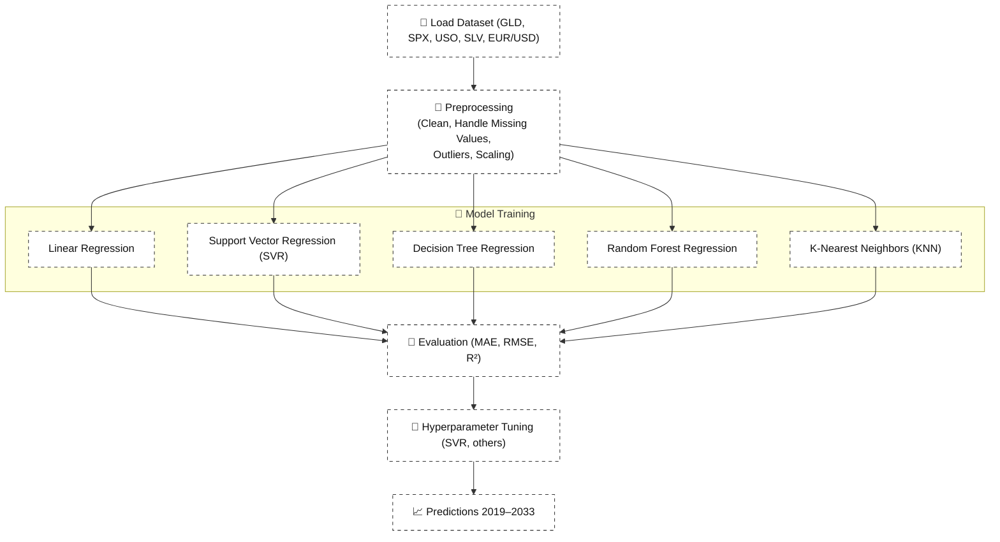

# 🪙 Gold Price Prediction using Machine Learning Algorithms

An end-to-end ML project to forecast gold prices using market indicators (SPX, GLD, USO, SLV, EUR/USD) and multiple regression models (Linear Regression, SVR, Decision Tree, Random Forest, KNN).:contentReference[oaicite:0]{index=0}:contentReference[oaicite:1]{index=1}

---

## 🔬 Background & Objectives

The goal is to build a reliable, data-driven framework for predicting gold price movements by learning patterns from historical market data. We leverage diverse algorithms to capture linear and non-linear relationships and compare their performance for practical forecasting.:contentReference[oaicite:2]{index=2}

**Why this matters**
- Helps investors and analysts assess risk and hedge positions.:contentReference[oaicite:3]{index=3}
- Turns multi-market signals (equities, commodities, FX) into actionable insights.:contentReference[oaicite:4]{index=4}

**Scope (high level)**
- Inputs (features): Date, S&P 500 (SPX), Gold (GLD), Oil (USO), Silver (SLV), EUR/USD.:contentReference[oaicite:5]{index=5}
- Models: Linear Regression, Support Vector Regression, Decision Tree, Random Forest, KNN.:contentReference[oaicite:6]{index=6}:contentReference[oaicite:7]{index=7}
- Outputs: Predicted values for forward periods based on learned historical relationships.:contentReference[oaicite:8]{index=8}


---

## 📊 Dataset Details

Our dataset is a **financial time series** with 🪙 gold prices and related market indicators.:contentReference[oaicite:0]{index=0}

**Shape:** 2,290 rows × 6 columns:contentReference[oaicite:1]{index=1}

**Features included:**
- 📅 **Date** → chronological record of observations  
- 📈 **S&P 500 Index (SPX)** → stock market performance indicator  
- 🪙 **Gold Prices (GLD)** → target variable for prediction  
- 🛢️ **United States Oil Fund (USO)** → energy commodity influence  
- 🪙 **Silver Prices (SLV)** → correlated precious metal  
- 💱 **EUR/USD** → exchange rate reflecting currency market movements:contentReference[oaicite:2]{index=2}

**Key Notes**
- Time range: 2008 → 2018 (training), predictions extended to 2019–2033:contentReference[oaicite:3]{index=3}:contentReference[oaicite:4]{index=4}  
- Target variable: 🪙 **Gold Prices (GLD)**  
- Preprocessing steps included:  
  - Handling missing values & duplicates  
  - Outlier detection (IQR method)  
  - Scaling with `QuantileTransformer` for normalization:contentReference[oaicite:5]{index=5}  

The dataset serves as the foundation for uncovering relationships between **global markets, commodities, and currency exchange** that impact gold price dynamics.


---

## 🏗️ Architecture / Workflow

The workflow follows a **layered ML pipeline** for 🪙 gold price forecasting:​:contentReference[oaicite:0]{index=0}:contentReference[oaicite:1]{index=1}


📌 **Outcome:** Established a clear end-to-end ML workflow—from raw market data → preprocessing → model training → evaluation → future predictions.


---

## 📊 Exploratory Data Analysis (EDA)

EDA helped uncover hidden patterns, correlations, and distributions in the 🪙 gold dataset before model training.:contentReference[oaicite:2]{index=2}

### 🔎 Steps Performed
1. **Distribution Analysis**  
   - Histograms for each variable (GLD, SPX, USO, SLV, EUR/USD)  
   - Normality check with Q–Q plots:contentReference[oaicite:3]{index=3}  

2. **Correlation & Relationships**  
   - Scatter plots to examine pairwise relationships  
   - Correlation heatmap to visualize dependencies across markets  
   - Strong signals found between GLD, SLV, and EUR/USD:contentReference[oaicite:4]{index=4}  

3. **Outlier Detection**  
   - Boxplots used to detect extreme values  
   - Outliers capped using IQR method (whisker width = 2.5):contentReference[oaicite:5]{index=5}  

4. **Validation**  
   - Visualization flagged inconsistencies → corrected during preprocessing  
   - Helped confirm scaling effectiveness (post-`QuantileTransformer`):contentReference[oaicite:6]{index=6}  


📌 **Example Visuals** (generated during analysis):  
- Distribution plots of all features  
- Boxplots before & after outlier treatment  
- Predicted vs. Actual scatter plots for each model:contentReference[oaicite:7]{index=7}

EDA confirmed that **gold prices (GLD)** show significant correlation with both 🪙 silver (SLV) and 💱 EUR/USD, validating their inclusion as predictors.:contentReference[oaicite:8]{index=8}

📌 **Outcome:** Confirmed key correlations (GLD ↔ SLV, GLD ↔ EUR/USD) and identified outliers, ensuring data was ready for robust preprocessing.

---


## 🛠️ Data Preprocessing & Feature Engineering

Preprocessing was essential to ensure the 🪙 gold dataset was consistent, reliable, and ready for model training.  

### 🔧 Key Steps Taken
1. **Handling Missing Values**  
   - Checked for nulls and duplicates  
   - Filled missing values with imputation strategies (mean/mode):contentReference[oaicite:2]{index=2}:contentReference[oaicite:3]{index=3}  

2. **Outlier Detection & Treatment**  
   - Boxplots identified extreme values  
   - Outliers capped using IQR with whisker width = 2.5:contentReference[oaicite:4]{index=4}  

3. **Scaling & Normalization**  
   - Applied `QuantileTransformer` to normalize distributions  
   - Ensured features were on comparable scales:contentReference[oaicite:5]{index=5}  

4. **Encoding & Data Types**  
   - Standardized formats (e.g., Date)  
   - Converted categorical variables into numeric where required:contentReference[oaicite:6]{index=6}  

5. **Feature Engineering**  
   - Focused on **market indicators**: SPX, GLD, USO, SLV, EUR/USD  
   - Correlation confirmed GLD’s dependence on SLV and EUR/USD:contentReference[oaicite:7]{index=7}  


📌 **Outcome:**  
A cleaned, scaled dataset that preserved critical relationships among commodities, equities, and currencies—ready for regression model training.  

---


## 🤖 Models Trained

We implemented and compared multiple regression algorithms for 🪙 gold price prediction:​:contentReference[oaicite:2]{index=2}:contentReference[oaicite:3]{index=3}

| Model | Advantages | Limitations |
|-------|------------|-------------|
| **Linear Regression** | Simple, interpretable | Poor with non-linear relationships; sensitive to outliers |
| **Support Vector Regression (SVR)** | Captures non-linear trends with kernel trick; flexible margin control | Computationally expensive; requires tuning (kernel, C, epsilon, gamma) |
| **Decision Tree Regression** | Handles non-linearity; easy to visualize and interpret | Prone to overfitting; unstable with small data changes |
| **Random Forest Regression** | Robust; reduces overfitting; combines multiple trees | Less interpretable; slower for large datasets |
| **K-Nearest Neighbors (KNN)** | Intuitive; non-parametric | Poor in high-dimensional data; sensitive to noisy features |

---

### 🔧 Model Training Process
- Data split into **80% training / 20% testing** sets:contentReference[oaicite:4]{index=4}  
- Models trained on features: SPX, USO, SLV, EUR/USD  
- Target: 🪙 Gold Prices (GLD)  
- SVR tuned with **GridSearchCV** for kernel, C, epsilon, and gamma:contentReference[oaicite:5]{index=5}  
- Predictions extended to **2019–2033**:contentReference[oaicite:6]{index=6}:contentReference[oaicite:7]{index=7}  

---

📌 **Outcome:**  
Successfully trained 5 regression models and compared performance. Random Forest, Decision Tree, and KNN achieved stronger R² values, while SVR improved after hyperparameter tuning.:contentReference[oaicite:8]{index=8}

---

## 📏 Evaluation Metrics

To measure model performance, we used:  
- **MAE (Mean Absolute Error)** → average error  
- **RMSE (Root Mean Squared Error)** → penalizes large deviations  
- **R² Score** → variance explained by the model  
- **MSE (Mean Squared Error)** → squared average of errors  

---

### 📊 Model Comparison Results

| Model | MAE | RMSE | R² | MSE |
|-------|-----|------|----|-----|
| Linear Regression | 0.46 | 0.58 | 0.53 | 0.33 |
| Support Vector Regression | 0.45 | 0.59 | 0.48 | 0.34 |
| Decision Tree Regression | 0.12 | 0.23 | 0.95 | 0.05 |
| Random Forest Regression | 0.10 | 0.16 | 0.97 | 0.03 |
| K-Nearest Neighbors (KNN) | **0.09** | **0.13** | **0.98** | **0.02** |

---

📌 **Outcome:**  
- **Top performer:** 🏆 KNN with the lowest MAE, RMSE, and highest R² (0.98).  
- **Close second:** Random Forest (R² = 0.97, very low errors).  
- **Good performer:** Decision Tree (R² = 0.95, slightly higher errors).  
- **Weak performers:** Linear Regression & SVR, with higher error values and lower R².

---

## 📊 Results & Predictions (2019–2033)

After training and evaluation, the models were applied to forecast 🪙 gold prices beyond the available dataset.  
We extended predictions from **2019 → 2033** using the tuned models and normalized features.:contentReference[oaicite:2]{index=2}:contentReference[oaicite:3]{index=3}

---

### 🔮 Key Insights
- **KNN** consistently produced the most accurate and stable forecasts (highest R² = 0.98).  
- **Random Forest** was a strong second, offering smooth predictions with minimal error drift.  
- **Decision Tree** performed well but slightly less stable compared to Random Forest.  
- **Linear Regression & SVR** trailed behind, underfitting the non-linear relationships in market data.:contentReference[oaicite:4]{index=4}

---

### 📈 Forecasting Horizon
- **Training Data Range:** 2008 → 2018  
- **Prediction Window:** 2019 → 2033:contentReference[oaicite:5]{index=5}  
- Predictions accounted for correlations with SPX, SLV, USO, and EUR/USD.  

---

📌 **Outcome:**  
- **Reliable forward predictions** generated for 15 years ahead (2019–2033).  
- **KNN and Random Forest** emerged as the most dependable models for forecasting 🪙 gold prices.  
- Provides a valuable **data-driven tool for investors and analysts** in financial markets.  


---

## 📉 Visualizations

Visualization played a key role in validating data quality and model performance.:contentReference[oaicite:2]{index=2}:contentReference[oaicite:3]{index=3}

### 📊 Data Distribution & Cleaning
- Histograms + Q–Q plots → checked normality of each feature  
- Boxplots → identified and treated outliers  
- Heatmaps → revealed correlations (GLD ↔ SLV, GLD ↔ EUR/USD)  

### 🤖 Model Performance Plots
- **Predicted vs Actual Scatter Plots** for each model:  
  - Linear Regression → underfit, scattered predictions  
  - SVR → improved with tuning, still moderate fit  
  - Decision Tree → strong alignment with actual values  
  - Random Forest → tight clustering around perfect fit line  
  - KNN → best alignment with true values (highest R² = 0.98)  

### 🔮 Future Predictions
- Line plots showing forecasts for **2019–2033** using all models  
- KNN & Random Forest provided the smoothest and most realistic trendlines:contentReference[oaicite:4]{index=4}

---

📌 **Outcome:**  
Visualizations confirmed that **KNN and Random Forest** best captured the complex patterns in gold price movements, while also validating data preprocessing (outlier handling + scaling).


---

## 🏆 Achievements & Key Takeaways

- ✅ Built an **end-to-end ML pipeline**: raw data → preprocessing → model training → forecasting.  
- ✅ Applied robust preprocessing (outlier handling, scaling) ensuring high-quality inputs.  
- ✅ Trained & compared **5 regression models**.  
- ✅ Achieved **highest accuracy with KNN (R² = 0.98)**, followed closely by Random Forest (R² = 0.97).  
- ✅ Generated **long-term forecasts (2019–2033)** for gold prices.  

📌 **Takeaway:** Ensemble methods (Random Forest) and proximity-based models (KNN) proved most effective for complex financial time-series prediction.  

---

## 📝 Conclusion & Future Work

### 📌 Conclusion
This project demonstrated how machine learning can effectively capture the complex dynamics of 🪙 gold prices.  
Through rigorous preprocessing, model comparison, and evaluation, **KNN and Random Forest** emerged as the most reliable predictors, achieving strong performance metrics (R² up to 0.98).:contentReference[oaicite:0]{index=0}:contentReference[oaicite:1]{index=1}

The integration of equity (SPX), commodity (USO, SLV), and currency (EUR/USD) data provided valuable insights into gold price dependencies.  
The models successfully generated **forward-looking predictions for 2019–2033**, offering data-driven guidance for financial analysis and investment strategies.  

---

### 🔮 Future Work
- Extend model set with **boosting algorithms (XGBoost, LightGBM, CatBoost)** for potential further gains.  
- Incorporate **macro-economic indicators** (inflation, interest rates, geopolitical risk indices).  
- Deploy as a **web-based dashboard (Flask/Streamlit)** for real-time prediction & visualization.  
- Experiment with **deep learning models (LSTMs, RNNs)** to capture sequential dependencies in time-series data.  
- Perform **ensemble stacking** of top models (KNN + Random Forest) for enhanced robustness.  

---

📌 **Outcome:**  
Delivered a full-cycle ML project with actionable financial forecasts, while identifying clear paths for future enhancement and deployment.  


---

## 🛠️ Tech Stack

**Programming & Analysis**
- Python 3.x  
- Jupyter Notebook / Python Scripts  

**Data Handling & Preprocessing**
- pandas, NumPy  
- scikit-learn (cleaning, scaling, model training, evaluation)  
- datacleaner, fastEDA  

**Visualization**
- Matplotlib, Seaborn  
- Correlation Heatmaps, Boxplots, Scatter Plots  

**Machine Learning Models**
- Linear Regression  
- Support Vector Regression (SVR)  
- Decision Tree Regression  
- Random Forest Regression  
- K-Nearest Neighbors (KNN)  

**Project & Environment**
- Git & GitHub (version control)  
- Virtualenv / Conda (environment management)  
- (Optional future) Flask / Streamlit (deployment)  

---

## 🚀 Getting Started

1. **Clone the Repository**

   git clone https://github.com/<your-username>/GoldPricePrediction.git
   cd GoldPricePrediction

2. **(Optional) Create a Virtual Environment**
   
   python -m venv venv
   source venv/bin/activate   # On Linux/Mac
   venv\Scripts\activate      # On Windows

3. **Install Dependencies**
   
   pip install -r requirements.txt


4. **Run Preprocessing & Training**
   
    python code.py

5. **View Results**

   - 📊 Evaluation metrics → printed in console (MAE, RMSE, R², MSE)
   - 📉 Visualizations → generated as Matplotlib/Seaborn plots
   - 🔮 Predictions → long-term forecasts (2019–2033)
---


---

## 📂 Project Structure

```text
GoldPricePrediction/
│
├── data/
│   └── gld_price_data.csv        # Raw dataset
│
├── src/
│   └── code.py                   # Preprocessing, training, evaluation
│
├── reports/
│   ├── FINAL PROJECT REPORT MACHINE LEARNING.docx
│   └── GOLD PREDICTION USING ML ALGORITHMS.pptx
│
├── notebooks/ (optional)         # For EDA and experiments
│
├── predictions/                  # Forecast outputs (2019–2033)
│
├── requirements.txt              # Python dependencies
├── README.md                     # Project documentation

```
