# 🪙 Gold Price Prediction using Machine Learning Algorithms

An end-to-end ML project to forecast gold prices using market indicators (SPX, GLD, USO, SLV, EUR/USD) and multiple regression models (Linear Regression, SVR, Decision Tree, Random Forest, KNN).:contentReference[oaicite:0]{index=0}:contentReference[oaicite:1]{index=1}

---

## 🔬 Background & Objectives

The goal is to build a reliable, data-driven framework for predicting gold price movements by learning patterns from historical market data. We leverage diverse algorithms to capture linear and non-linear relationships and compare their performance for practical forecasting.:contentReference[oaicite:2]{index=2}

**Why this matters**
- Helps investors and analysts assess risk and hedge positions.:contentReference[oaicite:3]{index=3}
- Turns multi-market signals (equities, commodities, FX) into actionable insights.:contentReference[oaicite:4]{index=4}

**Scope (high level)**
- Inputs (features): Date, S&P 500 (SPX), Gold (GLD), Oil (USO), Silver (SLV), EUR/USD.:contentReference[oaicite:5]{index=5}
- Models: Linear Regression, Support Vector Regression, Decision Tree, Random Forest, KNN.:contentReference[oaicite:6]{index=6}:contentReference[oaicite:7]{index=7}
- Outputs: Predicted values for forward periods based on learned historical relationships.:contentReference[oaicite:8]{index=8}

---

## 📊 Dataset Details

Our dataset is a **financial time series** with 🪙 gold prices and related market indicators.:contentReference[oaicite:0]{index=0}

**Shape:** 2,290 rows × 6 columns:contentReference[oaicite:1]{index=1}

**Features included:**
- 📅 **Date** → chronological record of observations  
- 📈 **S&P 500 Index (SPX)** → stock market performance indicator  
- 🪙 **Gold Prices (GLD)** → target variable for prediction  
- 🛢️ **United States Oil Fund (USO)** → energy commodity influence  
- 🪙 **Silver Prices (SLV)** → correlated precious metal  
- 💱 **EUR/USD** → exchange rate reflecting currency market movements:contentReference[oaicite:2]{index=2}

**Key Notes**
- Time range: 2008 → 2018 (training), predictions extended to 2019–2033:contentReference[oaicite:3]{index=3}:contentReference[oaicite:4]{index=4}  
- Target variable: 🪙 **Gold Prices (GLD)**  
- Preprocessing steps included:  
  - Handling missing values & duplicates  
  - Outlier detection (IQR method)  
  - Scaling with `QuantileTransformer` for normalization:contentReference[oaicite:5]{index=5}  

The dataset serves as the foundation for uncovering relationships between **global markets, commodities, and currency exchange** that impact gold price dynamics.

---

## 🏗️ Architecture / Workflow

The workflow follows a **layered ML pipeline** for 🪙 gold price forecasting:​:contentReference[oaicite:0]{index=0}:contentReference[oaicite:1]{index=1}

```mermaid
flowchart TB
    A["📂 Load Dataset (GLD, SPX, USO, SLV, EUR/USD)"]
    B["🧹 Preprocessing<br/>(Clean, Handle Missing Values,<br/>Outliers, Scaling)"]

    subgraph MODELS["🤖 Model Training"]
        direction LR
        C1["Linear Regression"]
        C2["Support Vector Regression (SVR)"]
        C3["Decision Tree Regression"]
        C4["Random Forest Regression"]
        C5["K-Nearest Neighbors (KNN)"]
    end

    D["📏 Evaluation (MAE, RMSE, R²)"]
    E["🔧 Hyperparameter Tuning (SVR, others)"]
    F["📈 Predictions 2019–2033"]

    %% Flow
    A --> B --> C1 & C2 & C3 & C4 & C5 --> D --> E --> F

    %% Dashed style for all boxes
    classDef dashed fill:#fff,stroke:#333,stroke-dasharray: 5 5,color:#111;
    class A,B,C1,C2,C3,C4,C5,D,E,F dashed;

```

---
---

## 📊 Exploratory Data Analysis (EDA)

EDA helped uncover hidden patterns, correlations, and distributions in the 🪙 gold dataset before model training.:contentReference[oaicite:2]{index=2}

### 🔎 Steps Performed
1. **Distribution Analysis**  
   - Histograms for each variable (GLD, SPX, USO, SLV, EUR/USD)  
   - Normality check with Q–Q plots:contentReference[oaicite:3]{index=3}  

2. **Correlation & Relationships**  
   - Scatter plots to examine pairwise relationships  
   - Correlation heatmap to visualize dependencies across markets  
   - Strong signals found between GLD, SLV, and EUR/USD:contentReference[oaicite:4]{index=4}  

3. **Outlier Detection**  
   - Boxplots used to detect extreme values  
   - Outliers capped using IQR method (whisker width = 2.5):contentReference[oaicite:5]{index=5}  

4. **Validation**  
   - Visualization flagged inconsistencies → corrected during preprocessing  
   - Helped confirm scaling effectiveness (post-`QuantileTransformer`):contentReference[oaicite:6]{index=6}  

---

📌 **Example Visuals** (generated during analysis):  
- Distribution plots of all features  
- Boxplots before & after outlier treatment  
- Predicted vs. Actual scatter plots for each model:contentReference[oaicite:7]{index=7}

EDA confirmed that **gold prices (GLD)** show significant correlation with both 🪙 silver (SLV) and 💱 EUR/USD, validating their inclusion as predictors.:contentReference[oaicite:8]{index=8}
---
